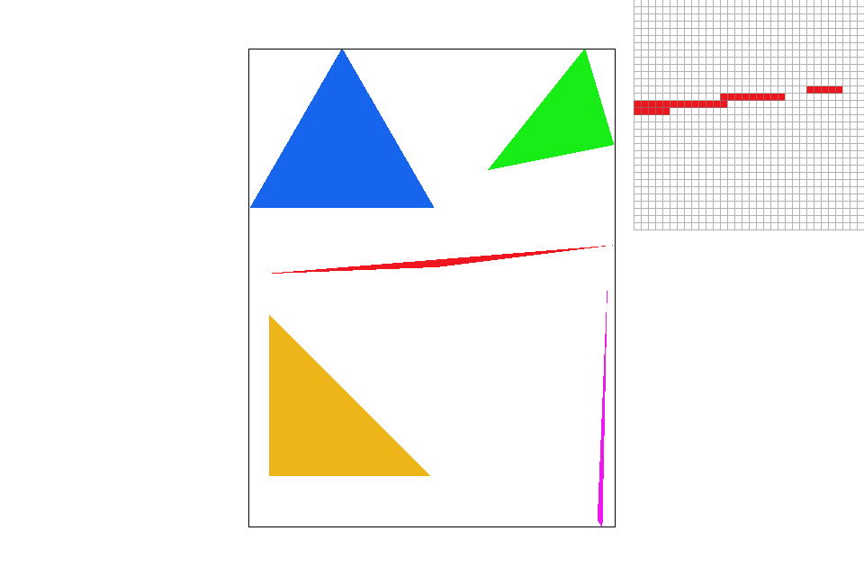
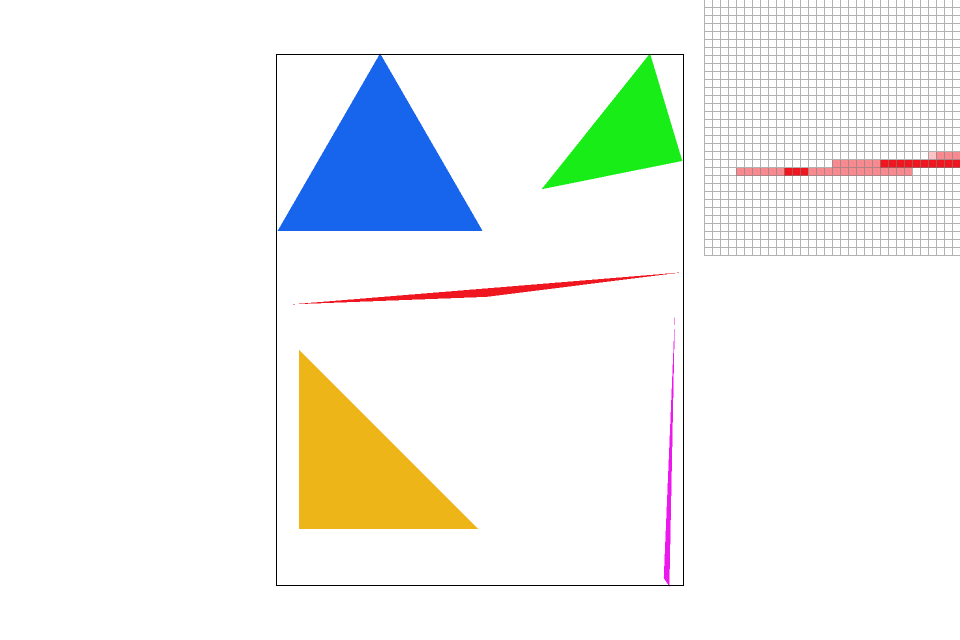
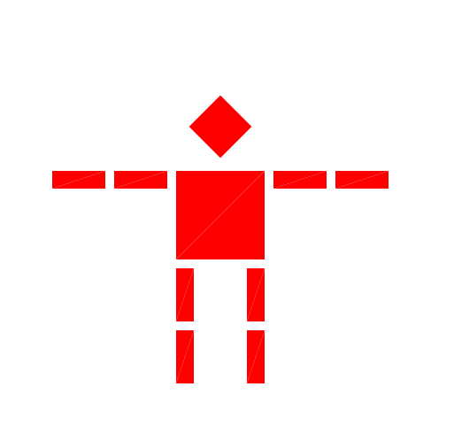
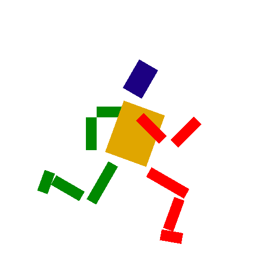
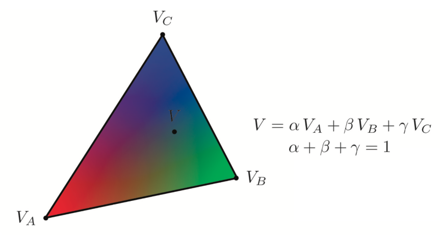
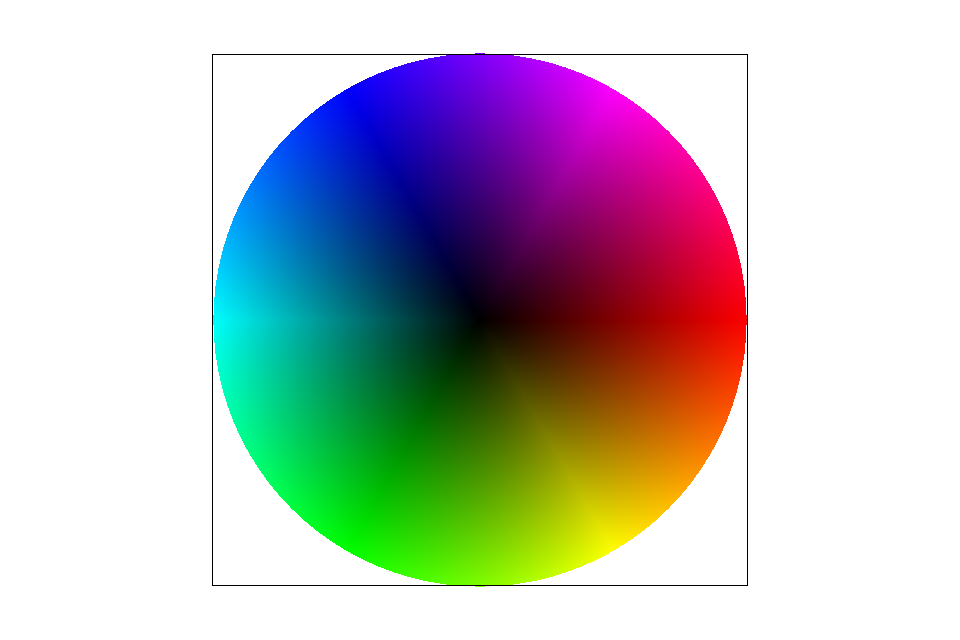
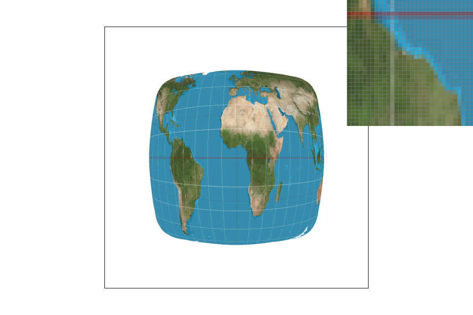
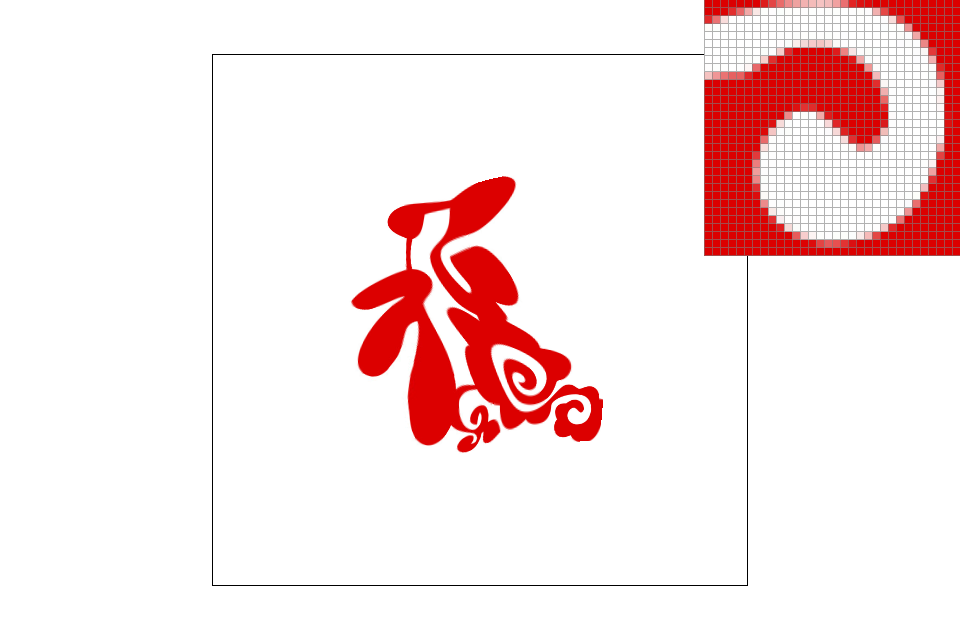

# Rasterizer
A simple rasterizer including point sampling, transforms, and texture mapping.

## Rasterization and Antialiasing

 
 
## Transforms

  

## Barycentric coordinates

  

## "Pixel sampling" for texture mapping

  

## "Level sampling" with mipmaps for texture mapping

